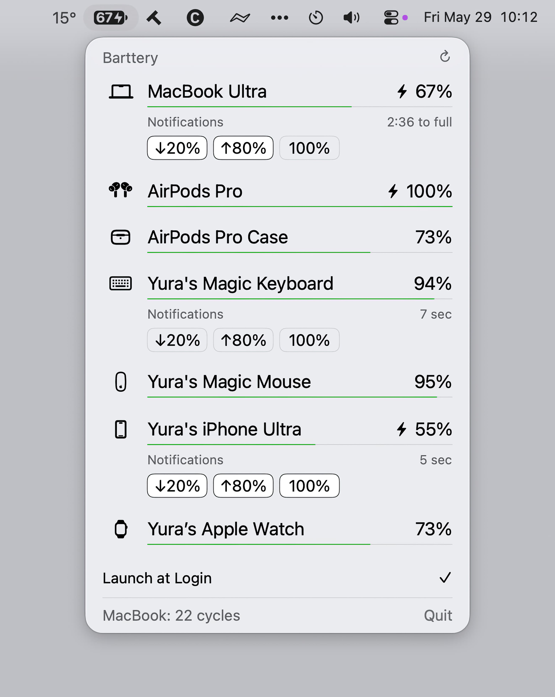

  

# Barttery

A macOS menu bar app that shows battery levels for all your devices in one place.

## Features

- MacBook — battery percentage with charging state icon, time to full / time remaining, cycle count
- iPhone & iPad — battery level via USB or Wi-Fi
- Apple Watch — battery level via paired iPhone
- AirPods — headphones and case battery levels with charging indicators
- Magic Keyboard, Mouse & Trackpad — battery levels via Bluetooth
- Logitech mice — MX Master 2S/3/3S/4, MX Anywhere 2S/3/3S, MX Ergo, M720 Triathlon, MX Vertical — battery level and charging indicator via HID++ 2.0
- Logitech keyboards — MX Keys, MX Keys Mini, MX Keys S, K380, K780, K850 — battery level via HID++ 2.0
- BLE devices — any Bluetooth LE peripheral with a standard Battery Service

Notifications — get alerted when any device drops to 20%, or reaches 80% / 100% while charging. Configure per device.

> **Logitech devices** require Input Monitoring permission (System Settings → Privacy & Security → Input Monitoring). Without it, Logitech devices still appear via Bluetooth with approximate battery level.

## Screenshot

## Requirements

- macOS 13 Ventura or later
- For iPhone / iPad / Apple Watch: connect via USB cable to Mac and enable Wi-Fi sync in Finder. On the first USB connection, you'll need to **Trust** the computer.

## Installation

- Download the latest DMG file from the [releases page](https://github.com/yurastegny/barttery/releases)
- Open the DMG file
- Drag the Barttery app to your Applications folder
- Launch Barttery — it appears in the menu bar
- On first launch, macOS may ask for Bluetooth and notification permissions — allow both

### How to run

Right now, in my region it's not possible to get an Apple Developer account. Without it, Apple does not trust the app. But you can open it using the following method:

1. Try to open the app by double-clicking it — you'll see a warning:
**"Barttery" can't be opened because the developer cannot be verified**.
2. Open **System Settings** → in the sidebar, click **Privacy & Security**.
3. Scroll down to the **Security** section.
4. You'll see a message like:
**"Barttery" was blocked from use because it is not from an identified developer**.
Next to it, there will be a button "**Open Anyway**" (sometimes just "**Open**").
5. Click "**Open Anyway**".
6. Enter your administrator password, then confirm by clicking "**Open**".

After this, the app will be added to the exceptions list and will launch normally.

## License

Barttery is licensed under the **GPL-2.0-or-later** license. The following third-party components are bundled:

| Component | License |
|---|---|
| [libimobiledevice](https://github.com/libimobiledevice/libimobiledevice) (`ideviceinfo`, `idevice_id`, `comptest`, `bartbeat`) | GPL-2.0+ |
| [libimobiledevice-glue](https://github.com/libimobiledevice/libimobiledevice-glue) | LGPL-2.1+ |
| [libplist](https://github.com/libimobiledevice/libplist) | LGPL-2.1+ |
| [libusbmuxd](https://github.com/libimobiledevice/libusbmuxd) | LGPL-2.1+ |
| [OpenSSL 3](https://github.com/openssl/openssl) (`libssl`, `libcrypto`) | Apache-2.0 |

